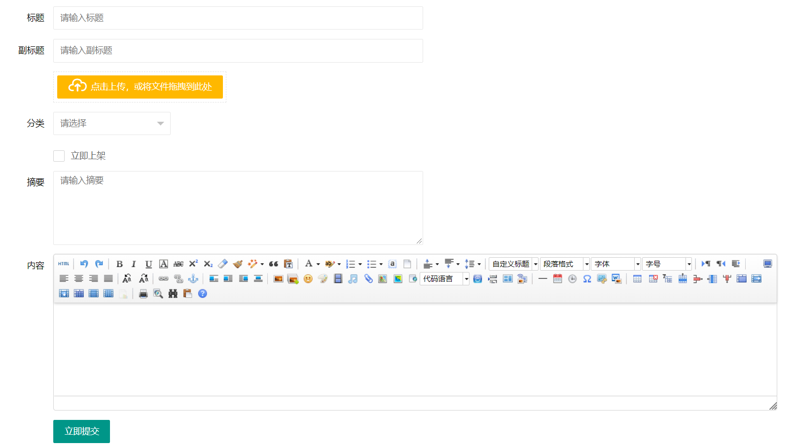

# layui-form
layui form html builder

安装

    composer require hiicup/layui-form
    
注册服务

    \Hiicup\Layui\Html\LayuiHtmlBuilderServiceProvider::class
    
门面

    "Layui"=> \Hiicup\Layui\Html\LayuiFacade::class
    
使用

```php
    <form class="layui-form" action="">
        {!! Layui::input("title","标题") !!}
        {!! Layui::bigInput("alias","副标题") !!}
        {!! Layui::uploadOneImg("img") !!}
        {!! Layui::selectSearchText('cid',["西安","北京"],"分类") !!}
        {!! Layui::checkbox("state",1,"立即上架") !!}
        {!! Layui::textarea("info",'摘要') !!}
        {!! Layui::ueditor("content","内容") !!}
        {!! Layui::submit() !!}
    </form>
```


效果：

